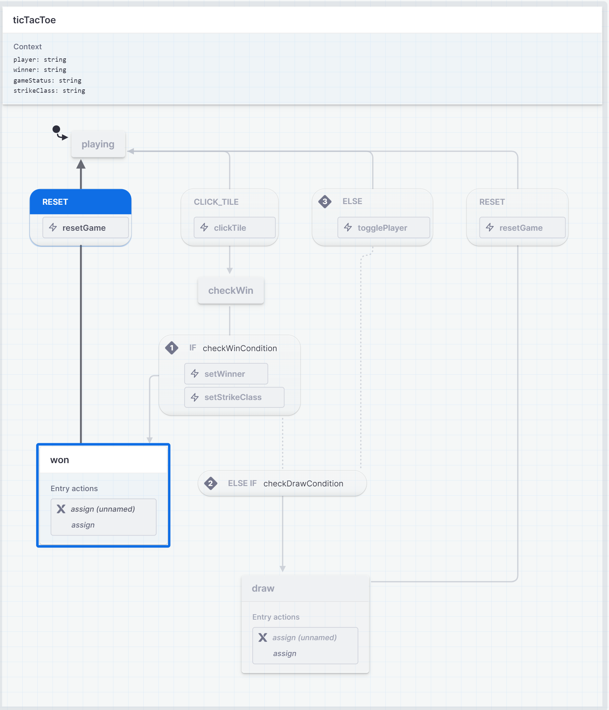

# Tic-Tac-Toe Game

## Table of Contents

1. [General Info](#general-info)
2. [Technologies](#technologies)
3. [Components and Features](#components-and-features)
4. [Setup](#setup)

## General Info

This project is a simple implementation of the classic Tic-Tac-Toe game. It allows two players to play in turns on a 3x3 grid.

## Technologies

The project is developed using the following technologies:

- React
- JavaScript (ES6+)
- Jest

## Components and Features

### Key Components

- **State Management:** The game state is managed using a finite state machine (FSM) which helps handle various scenarios such as winning, drawing, and resetting the game.
- **UI:** The user interface is built using React, ensuring a dynamic and responsive experience.
- **Testing:** Jest is used for unit testing to ensure the reliability of the game logic and components.

### States and Actions

- **playing:** The initial state of the game where players take turns.
- **won:** The state when one player wins.
- **draw:** The state when the game ends in a draw.
- **reset:** The state to reset the game.

### Events

- **CLICK_TILE:** Event triggered when a player clicks a tile.
- **RESET:** Event triggered to reset the game.

### Conditions

- **checkWinCondition:** Checks if the current player has won.
- **checkDrawCondition:** Checks if the game is a draw.

### Actions

- **resetGame:** Resets the game to the initial state.
- **clickTile:** Handles the tile click event.
- **togglePlayer:** Switches the turn to the other player.
- **setWinner:** Sets the winner of the game.
- **setStrikeClass:** Sets the CSS class for the strike line.

### Flowchart

The following flowchart illustrates the state transitions and actions taken in the game:

### Context

- **player:** The current player ('X' or 'O').
- **winner:** The winner of the game.
- **gameStatus:** The current status of the game (e.g., 'playing', 'won', 'draw').
- **strikeClass:** CSS class for the strike line when a player wins.

## Setup

### Installation Instructions

1. Clone the repository:
   git clone <repository-url>
2. Navigate to the project directory:
   cd tic-tac-toe
3. Install the dependencies:
   npm install

### Running the Project

1.  To start the project, run:
    npm start
    This will launch the game in your default web browser.

### Running Tests.

1.  To start the project, run:
    npm test
